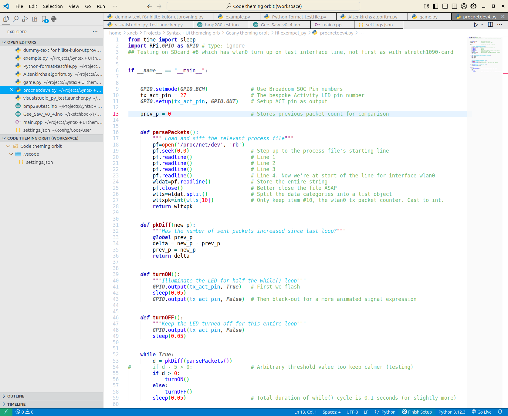

# NucNucNuc Light vsCode Theme

***

### Description

*(Version 1.0.2)*

A no-nonsense bespoke colour-scheme and "light" UI theme for the VSCE, based on "*theme-bluloco-light* ".

***
Some syntax sample screenshots:

Extra extensions used in the screenshots:

-  *vscode-icons-mac, version: 7.25.3*
-  *vscode-highlight, version: 1.9.0*

***

